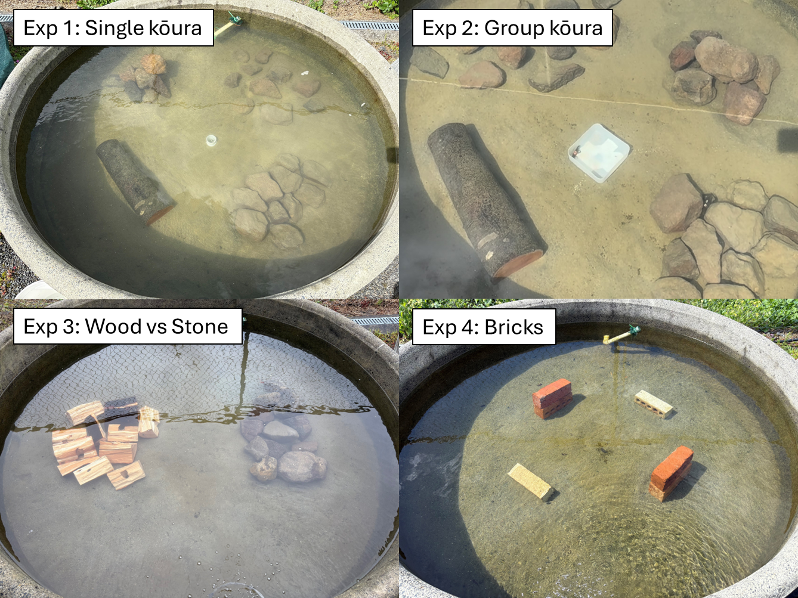

```{r}
#| label: start
#| include: false

# run analysis notebook to make all variables available
knitr::knit("analysis.qmd", output = tempfile(), quiet = TRUE)
```

# Introduction
Crayfish are among the most threatened freshwater invertebrates globally, with 32% of species assessed as threatened with extinction due to habitat loss, water quality decline, and invasive species [@Richman2015]. As keystone species and ecosystem engineers, crayfish play crucial roles in freshwater food webs through shredding of leaf litter, bioturbation of sediments, and nutrient cycling, and their loss can have profound cascading effects on freshwater ecosystems [@Momot1995; @Collier1997; @Parkyn2001]. The increasing degradation of freshwater habitats therefore not only threatens crayfish populations, but also risks disrupting the ecosystem processes crayfish sustain. 

Habitat complexity is a key driver of crayfish population persistence, as structurally diverse habitats provide physical refugia from predators, foraging opportunities, and shelter during moulting when individuals are particularly vulnerable [@Hammond2006]. Crayfish use a wide variety of natural and artificial structures as shelter, including rocks, woody debris, and even anthropogenic objects such as bottles and discarded appliances [@Parkyn2009; @Adams2014], demonstrating considerable flexibility in habitat use. In the context of freshwater restoration, increasing structural complexity through providing artificial shelters has improved crayfish abundance and restocking success in degraded streams and lakes [@Huolila1997; @Johnsen2008], and the availability of coarser substrate has also been shown to improve juvenile survival rates [@Mazlum2017]. These findings indicate that enhancing habitat complexity can be a useful management tool for threatened crayfish populations. While artificial reef design has received attention in marine systems [ @Frehse2025], equivalent systematic comparisons of shelter configurations for freshwater crayfish restoration remain largely absent from the literature.

Shelter selection in crayfish is strongly influenced by body size, as individuals actively select refugia proportional to their dimensions. Crayfish individuals selected stones more than 3 times longer and 1.25 times wider than their carapace length, with larger males consistently selecting larger stones [@Streissl2002]. Body size and shelter dimensions have direct competitive consequences as crayfish in undersized shelters initiated and won more fight then those in appropriately sized shelters, suggesting that shelter fit influences an individual's assessment of its own fighting ability [@Percival2010]. These size-shelter relationships have important implications for artificial reef design, as structures providing a range of refuge sizes may be necessary to accommodate different life stages and size classes simultaneously. 

Social dynamics further complicate shelter use, as competitive interactions among conspecifics can determine which individuals gain access to preferred refugia. Dominance hierarchies based on body size and reproductive status show that males and maternal females often are able to overtake shelters from non-maternal females, while adults consistently outcompete juveniles for shelter access [@Figler2005]. Body weight ratio between contestants is a strong predictor of shelter takeover success, although prior ownership is also important as smaller residents successfully resisted eviction by larger intruders [@Ranta1993]. The effect of prior ownership depends on the duration of residency and also on the quality of the shelters. As when small and large individuals had high quality shelters evictions were reduced compared to when small animals had low-quality shelters they were more often evicted by larger individuals [@Takahashi2019]. At the population level, habitat complexity buffers these competitive effects, as shown with juveniles in structurally complex habitats having higher survival rates, faster growth and greater moulting rates compared to juveniles in less complex habitats, as more shelter availability reduces agonistic interactions [@Olsson2009]. Together these findings suggest that the number, size distribution and spatial arrangement of shelters within an artificial reef can influence which cohorts within a crayfish population gain access to preferred shelter. 

The material and structural properties of artificial shelters also influence their protective value. PVC pipes are used and found to provide greater protection for crayfish against predatory fish, than stone or aquatic vegetation, likely due to their enclosed structure and consistent hole dimensions [@Zhao2024]. Other studies comparing artificial reef configurations show that the availability of small shelter spaces is more important than total reef volume on fish assemblage [@Hylkema2020]. Rock pile designs constructed from locally sourced material have shown intermediate performance at a fraction of the construction cost, representing a viable low-cost alternative to manufactured reef units [@Hylkema2020]. Moreover, the use of synthetic materials in restoration ecology brings ecological concerns particularly in contexts where introducing non-native materials may conflict with conservation values or indigenous cultural frameworks [@Wehi2017]. Natural materials such as stones and wood offer ecologically compatible alternatives, with stone structures naturally providing a range of crevice sizes suited to different body sizes, and offering greater long-term durability in submerged conditions compared to wood [@Parkyn2009]. 

The Aotearoa-New Zealand (hereafter Aotearoa), the endemic freshwater crayfish kōura (*Paranephrops planifrons*) faces conservation pressure from habitat loss, water quality degradation, and predation by invasive species [@Lee2025; @Kusabsinrevision]. Kōura are a taonga (culturally treasured) species for Māori, the indigenous people of Aotearoa, and hold significant ecological and cultural value in freshwater ecosystems [@Kusabs2009]. In their natural habitat, kōura are positively associated with overhanging banks, coarse substrates, and woody debris [@Usio2000; @Jowett2008; @Parkyn2009; @Raveninreview]. However, a systematic study on artificial reef preference on crayfish remains largely absent from the literature. Habitat restoration using artificial reefs represents a promising management tool for kōura recovery, and the use of natural materials aligns with ecological and cultural values set for these natural and cultural important lakes. 

In this study four controlled mesocosm experiments were executed to identify kōura preferences among different artificial reef structures varying in material and configuration, to examine how individual behaviour, body size, and group interactions influence refuge selection. We predicted that (1) structurally complex reefs providing enclosed crevices would be preferred over isolated or open structures, as enclosed spaces reduce predation risk, (2) reef preference would be size-dependent, with larger kōura selecting reefs with larger refuge spaces [@Streissl2002; @Percival2010], (3) stone-based reefs would be preferred over wood due to greater structural stability, and (4) material type alone does not influenced refuge preference between concrete and wooden bricks. The results provide practical guidance for designing cost-effective, ecologically appropriate artificial reefs to support kōura population recovery.


# Materials and Methods
## Animal collection
In mid-August 2025, 72 kōura were sourced from lakes Ōkāreka and Tikitapu (Blue Lake), located within the Rotorua Te Arawa Lakes area in the North Island of Aotearoa. Collected animals were transported to the Aquatic Research Centre at the University of Waikato in Hamilton. Individuals were assigned to one of three size classes based on orbital carapace length (OCL): small (< 22 mm), medium (22–30 mm), and large (> 30 mm). Each animal was marked with a unique identification number written on the carapace using an orange oil-based paint marker (Sharpie, medium point) [@Ramalho2010].

## Holding tank setup
Kōura were acclimatised for 12 days in outdoor concrete holding tanks (Ø 1.4 m, 0.5 m deep), each filled to a depth of 0.4 m with dechlorinated water that had been conditioned for three months. Paving sand was used as substrate, and shelters were provided as PVC pipes, broken terracotta pots, and perforated building bricks. Each holding tank housed 10–12 kōura. Kōura were fed every second day with two sinking fish food pellets per individual (Hikari Tropical Carnivore Pellets; animal protein content 47%).

## Experiment tank setup
Experiments were conducted outside in six circular concrete tanks (1425 L; Ø 1.85 m, 0.53 m deep), each filled to a depth of 0.4 m with dechlorinated water conditioned for three months. Paving sand was used as substrate in all experimental tanks. Tanks were closed off with a lid constructed of two layers of shade cloth to prevent escape and minimise sun activity. Fresh dechlorinated tap water and an air stone was added to each tank in between the experimental rounds. To prevent temperatures in the tanks getting too high the experiments were conducted in spring (September till October).

## Exp 1: Single kōura
This experiment assessed individual kōura reef preference by offering single animals a choice among four reef structures. Six experimental tanks were used, each housing a single medium-sized kōura. A total 30 koura consisting of 15 females with mean OCL and weight ± SD: `r get_sex(size_stats1, "F", "mean_ocl")` ± `r get_sex(size_stats1, "F", "sd_ocl")` mm, range: `r get_sex(size_stats1, "F", "min_ocl")`–`r get_sex(size_stats1, "F", "max_ocl")` mm, `r get_sex(size_stats1, "F", "mean_wt")` ± `r get_sex(size_stats1, "F", "sd_wt")` g and 15 males: `r get_sex(size_stats1, "M", "mean_ocl")` ± `r get_sex(size_stats1, "M", "sd_ocl")` mm, range: `r get_sex(size_stats1, "M", "min_ocl")`–`r get_sex(size_stats1, "M", "max_ocl")` mm, `r get_sex(size_stats1, "M", "mean_wt")` ± `r get_sex(size_stats1, "M", "sd_wt")` g were tested across five experimental replicates, with each replicate lasting 22 hours. Kōura were offered a choice between four reef types (@fig-exp-setup): SingleStone (ten quarried stones (150–250 mm) placed separately), FlatStone (ten quarried stones arranged tightly without stacking), StonePile (ten quarried stones stacked to form a pile), and WoodLog (a tānekaha (*Phyllocladus trichomanoides*) log (500 mm long, 150 mm diameter) containing six drilled holes (70 mm deep, 32 mm diameter)).

Each experimental tank was divided into four quadrants, with one reef type placed at random (randomizer.org) in each quadrant. If a kōura was not using a reef, TankWall was noted as location which represents the wall of the tank. For each trial, a single kōura was placed inside a vertically oriented plastic tube (50 mm long, open at one end and sealed at the other) positioned at the centre of the tank, with the sealed end resting on the substrate. This ensured a standardised starting position from which the kōura could exit in any direction. The time taken for the kōura to locate its first reef structure was recorded (L0). On the following day, the final location of the kōura was noted (L1) after which it was removed from the tank. Tanks were reset and reef placements re-randomised prior to the next trial. Each kōura was used in a single trial only and was not reused across replicates.

To test the difference between the reef types where the kōura were found the next day a multinomial goodness-of-fit test was performed using the XNomial package [@Engels2014]. TankWall was excluded from preference tests as it represents the absence of reef choice rather than a reef type preference. Additionally, pairwise likelihood-ratio G-tests with Bonferroni correction were used to identify which reef types differed significantly from each other. To test whether reef type use differed between sexes, Fisher’s exact test with simulated p-values (9999 replicates) was used due to small expected counts. A permutation-based symmetry test was applied to assess whether reef type transitions between L0 and L1 were directional rather than random. To confirm nocturnal activity, three GoPros (Hero 3) were placed in one tank at the end of the day and recorded for five hours. 

## Exp 2: Group kōura
Building on experiment 1, this experiment examined how group dynamics and body size influenced reef preference when kōura were housed together. The six experimental tanks were used and configured with the same reef types and randomisation procedure as in experiment 1 (@fig-exp-setup). In contrast to the single-animal trials, each tank housed a group of six kōura, comprising two small, two medium, and two large males. Size classes were defined by OCL: small (< 22 mm; mean ± SD: `r get_size(size_stats2, "S", "mean_ocl")` ± `r get_size(size_stats2, "S", "sd_ocl")` mm, range: `r get_size(size_stats2, "S", "min_ocl")`–`r get_size(size_stats2, "S", "max_ocl")` mm, `r get_size(size_stats2, "S", "mean_wt")` ± `r get_size(size_stats2, "S", "sd_wt")` g), medium (22–30 mm; `r get_size(size_stats2, "M", "mean_ocl")` ± `r get_size(size_stats2, "M", "sd_ocl")` mm, `r get_size(size_stats2, "M", "min_ocl")`–`r get_size(size_stats2, "M", "max_ocl")` mm, `r get_size(size_stats2, "M", "mean_wt")` ± `r get_size(size_stats2, "M", "sd_wt")` g), and large (> 30 mm; `r get_size(size_stats2, "L", "mean_ocl")` ± `r get_size(size_stats2, "L", "sd_ocl")` mm, `r get_size(size_stats2, "L", "min_ocl")`–`r get_size(size_stats2, "L", "max_ocl")` mm, `r get_size(size_stats2, "L", "mean_wt")` ± `r get_size(size_stats2, "L", "sd_wt")` g). Each group was introduced to the centre of the tank within an open-top plastic container (150 × 150 × 85 mm). The container was then removed, and the location of each individual was recorded. On the following day, the final location of each kōura was documented, before all individuals were removed from the tank. This procedure was repeated across five experimental replicates reusing the same six groups of animals.

To test whether overall reef preference existed at the group level, one-sample Wilcoxon signed-rank tests were applied to group-round proportions for each reef type, testing against a null expectation of 0.25 (equal distribution among four reef types). P-values were Bonferroni adjusted for multiple comparisons. To test whether size classes affected reef preference while accounting for repeated measurement of individuals and groups, a Bayesian categorical mixed-effects model was fitted using the brms package [@Burkner2025], with reef type as the outcome, size class as a fixed effect, and group identity, individual identity nested within group, and experimental round as random intercepts. Normal approximation was used due to ties arising from discrete group counts. The Stuart-Maxwell test was used to test for statistical differences between stage L0 and L1. 

## Exp 3: Wood vs Stone
Using the same groups from experiment 2, this experiment narrowed the choice to two reef types, stone and wood, to directly compare preference between these materials. The reef types were: (1) a flat stone reef (FlatStone) constructed from twelve stones placed tightly together, and (2) a wood reef consisting of twelve wood splits (WoodSplit) made from the tānekaha logs (@fig-exp-setup). Each group was released at the centre of the tank, and the initial reef selected by each kōura was recorded. The following day, the final location of each kōura was documented. This procedure was repeated three times, reusing the same six groups of animals.

To test the difference between FlatStone and WoodSplit the Wilcoxon signed-rank test was applied to group-round proportions for each reef type, testing against a null expectation of 0.5. P-values were Bonferroni adjusted. To test whether size classes affected reef preference while accounting for repeated measurement of individuals and groups, a similar Bayesian categorical mixed-effects model was fitted. The Stuart-Maxwell test was used to test for statistical differences between stage L0 and L1.

## Exp 4: Bricks
This experiment tested whether kōura showed a preference between concrete and wooden perforated brick structures, to isolate the effect of material on reef preference. Two perforated building bricks (BrickArtificial) of 80 × 80 × 225 mm with five holes (Ø 30 mm) were tested against two wooden bricks (BrickWood) made from Western red cedar (*Thuja plicata*), constructed to match the building bricks in external dimensions and hole size. To prevent floating a solid clay brick of identical dimensions was placed on top of each wooden brick (@fig-exp-setup). New groups of ten kōura and four experiment tanks were used for this experiment, comprising a total of 40 individuals consitting of 18 females with mean OCL and weight ± SD: `r get_sex(size_stats4, "F", "mean_ocl")` ± `r get_sex(size_stats4, "F", "sd_ocl")` mm, range: `r get_sex(size_stats4, "F", "min_ocl")`–`r get_sex(size_stats4, "F", "max_ocl")` mm, `r get_sex(size_stats4, "F", "mean_wt")` ± `r get_sex(size_stats4, "F", "sd_wt")` g and 22 males: `r get_sex(size_stats4, "M", "mean_ocl")` ± `r get_sex(size_stats4, "M", "sd_ocl")` mm, range: `r get_sex(size_stats4, "M", "min_ocl")`–`r get_sex(size_stats4, "M", "max_ocl")` mm, `r get_sex(size_stats4, "M", "mean_wt")` ± `r get_sex(size_stats4, "M", "sd_wt")` g. Due to reduced animal availability, individuals were drawn from a broader size range than in previous experiments, resulting in unbalanced size class representation (small: n = 4, medium: n = 35, large: n = 1). In each of the four experimental tank quadrants one brick was placed, with similar brick types  positioned opposite to one another. Each group of kōura was released at the centre of the tank and the following day, the final location of each kōura was documented. This experiment was repeated four times by reusing the four groups of ten kōura.

To test whether kōura showed a preference between BrickArtificial and BrickWood, the Wilcoxon signed-rank test was applied to group-round proportions for each reef type, testing against a null expectation of 0.5 and P-values were Bonferroni adjusted. A paired Wilcoxon signed-rank test was used to directly compare group-round proportions between BrickArtificial and BrickWood. As size class was unbalanced, the effect of sex on reef preference was tested using a similar Bayesian categorical mixed-effects model. Finally, as only next-day locations (L1) were recorded in this experiment, no directional shift analysis was performed.


# Results
## Exp 1: Single kōura
Individual kōura showed a significant overall difference in reef preference (*p* = `r format_pval(p_xmulti1)`), with WoodLog selected significantly more often than SingleStone, FlatStone, and StonePile (pairwise G-test, Bonferroni adjusted: *p* = `r format_pval(p_single_vs_wood1)`, `r format_pval(p_flat_vs_wood1)`, `r format_pval(p_pile_vs_wood1)`, respectively; @fig-exp1). No significant differences were found among the stone reef types. Overall, WoodLog was selected by `r pct_wood_overall`% of kōura at L1 (males: `r pct_wood_male`%; females: `r pct_wood_female`%), though reef preference did not differ significantly between sexes (Fisher's exact test: *p* = `r format_pval(p_fisher1)`). The symmetry test indicated that reef type use shifted between L0 and L1 (*p* = `r format_pval(p_symtest1)`), suggesting kōura actively relocated to preferred reef types overnight rather than remaining at their initial location.

## Exp 2: Group kōura
At group level, FlatStone was used significantly more (*p* = `r format_pval(p_wilcox2_flat)`), while SingleStone (*p* = `r format_pval(p_wilcox2_single)`) and WoodLog (*p* = `r format_pval(p_wilcox2_wood)`) were significantly avoided. StonePile did not differ from random expectation (*p* = `r format_pval(p_wilcox2_pile)`; @fig-exp2), and did not differ significantly from FlatStone (*p* = `r format_pval(p_fs_vs_sp)`). Size classes had limited but credible effect on reef preference. Medium sized kōura showed a weaker preference for FlatStone over SingleStone compared to small kōura `r format_brms(m_exp2_bayes, "muFlatStone_size_classM", p_post_flatM)`, while no other size class effect was credible. Overall, FlatStone remained the most selected reef type across all size classes, but its strength of preference declined from small (posterior probability of top choice = `r pct_top_S`%) to medium (`r pct_top_M`%), and large kōura showing similar preference between FlatStone and StonePile (`r pct_flat_L`% vs `r pct_pile_L`%). Reeftype use shifted directionally between L0 and L1 (Stuwart-Maxwell test: *p* = `r format_pval(p_smtest2)`), incicating that kōura actively relocated to preferred reef types overnight. 

## Exp 3: Wood vs Stone
Kōura consistently selected FlatStone over WoodSplit, with the preference growing with body size (@fig-exp3). FlatStone was used significantly more (*p* = `r format_pval(p_wilcox3_flat)`), while WoodSplit reefs were actively avoided (*p* = `r format_pval(p_wilcox3_split)`). The model indicated that preference for FlatStone strengthened with body size, with the posterior probability of FlatStone being the top-ranked reef increasing from small (`r pct_top3_S`%) to medium (`r pct_top3_M`%), to large kōura (`r pct_top3_L`%). Reef type use shifted directionally between L0 and L1 (Stuart-Maxwell test: *p* = `r format_pval(p_smtest3)`), indicating that kōura actively relocated to preferred reef types overnight.

## Exp 4: Bricks
Kōura used both birck types, showing no significant preference between BrickArtificial and BrickWood (*p* = `r format_pval(p_bw_vs_ba)`; @fig-exp4), with mean group proportions of `r pct_bart4`% and `r pct_bwood4`% respectively. Sex had no credible effect on reef preference `r format_brms(m_exp4_bayes, "muBrickWood_sexM", p_post_sexM)`.

# Discussion

**Structure matters more than material**
The main finding from this study is that when dimensions of a refuge were kept equal, material is not a driving factor in refuge choice. This changes when structural differences as structural stability change with reef material. Experiment 4 shows that when koura were presented with similar refuge sizes in wood and stone material no specific preference for any material was suggested. In experiment 3 where similar reef structure was tried to make by comparing WoodSplit and FlatStone the wood splits were sinking but created less structural stable refuge places than the FlatStone reef [Citetion needed]. 

When koura were alone the most preferred reef was WoodLog but when tested in groups this changed and the most preferred reef type became FlatStone followed by StonePile. This is probably due to the effect that when koura were alone they searched the refuge that would give most protection [Citetion needed], and the drilled holes in the WoodLog offer most protection as found for PVC tubes [@Zhao2024]. When in a group the koura might also search for safety in numbers as occupying a crevice next to an other or with close proximity to others might present early warning signals.

As koura are taonga species and following animal ethics the number of animals was finite, the best was done with the anmals available. In experiments 2, 3, and 4 the number of independent groups was low with only six groups in exp 2 and 3 and only four groups in exp 4. Which constrains statistical power for detecting group effects [Citation]. The reuse of  the groups across replicats and experiments introduces the possibility of learning as koura might modify there refuge choice on 

In the first round of exp 2 WoodLog was most selected reef (17 out of 36 times), it could be that koura have learned that the WoodLog is not ideal and moved to other reefs it could also have happened as the group experiment was repeated with the same groups five times while the single koura were only used once. 

**Body size and competitive dynamics**
Koura especially larger sized individuals were found more in the FlatStone than the WoodSplit as they are most likely to evict smaller individuals from this more preferred reef type. When more stone reefs were available as in experiment 2, the larger individuals used both FlatStone and StonePile equally while for smaller individuals the FlatStone was most preferred probably as this reef type creates the most available crevices. Koura populations have a hierarchy which is size-based [@Stewart2011], which can explains why the larger koura were able to select the stable refuge spaces in the stone-based reefs in experiment 3. 

**Restoration implications**
Stone based reefs are the recommended reef type for koura restoration as they provide the most variation in crevice sizes, are structurally stable and cost effective compared to manufactured alternatives [@Hylkema2020]. The use of natural materials is recommended as they have the least impact on the ecosystem compared to plastics or other manufactured constructions [@Wehi2017]. For in lake use it is advised to use rocks of a size of 100-300 mm as this stone size is advised by  koura are positively associated with substrate size [@Olsson2006; @Johnsen2008; @Jowett2008; @Kusabs2015]. For lake deployment it is expected that FlatStone reefs will disappear faster in sofrter sediments than a StonePile reef [Citation], therefore it is recommended to build reefs in the shape of a pile to offer greater long-term structural percistence in lake environments. 


## Conclusion
This study demonstrates that refuge configuration and structural stability are more important determints of koura habitat preference than material composition alone. When structural properties differd stone based refugia had stronger preference this was not shown when dimantions and structure were kept constant. individual koura preferd enclosed wood log structures while in groups koura preferred 

Field validation of these mesocosm-derived preferences remains an important next step for translating these findings into effective restoration practice.

<!--As the findings of the four different experiments suggest is the material of the reefs not as important as the configuration.Further, the configuration of how the stones were laid was little less important as long as the stones provide interstitial pore spaces to use as refuge like in FlatStone and in StonePile (exp 2). The difference in preferred reef type between single (exp 1) and a group of kōura (exp 2), as single kōura most often chose for the WoodLog and the group of kōura for FlatStone followed by StonePile. This might be explained by the group effect as kōura are a prey species they might stick together to find safety in numbers and as the holes in the log were separated individual holes, they do not see the others. 

In round 1 of the group experiment wood was also the most preferred structure but in the later rounds it changed to flat and pile. As the group animals all have been reused 5 times compared to the single study where each animal was used just once. 

In these experiments it was assumed that kōura are at night leaving their initial refuge and started exploring the rest of the reef types and then in the morning they search refuge in the reef they thought was giving them most protection.

FlatStone has probably the highest number of compared to the SingleStone and StonePile
Wood most preferred reef structures

-->


# Acknowledgements

# Tables

# Figures
{#fig-exp-setup}









# Supplementary information